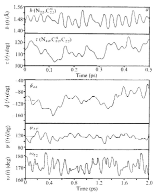

## Introduction

In this lesson we will carry out an MD simulation of the protein bovine pancreatic trypsin inhibitor (BPTI). This was one of the first proteins to ever be simulated in its entirety, and the results of this simulation – that at its time was a computational tour de force – can be found in a Nature article from 1977 by Andy McCammon, Bruce Gelin, and Martin Karplus (co-recipient of the 2013 Nobel Prize in Chemistry).  We will carry out a very similar simulation in just a few minutes!

## Starting structure and simulation preliminaries

The X-ray crystal structures (and NMR-derived structures) of many folded proteins can be found at the [Protein Data Bank](http://www.rcsb.org). Every structure deposited in the PDB has a four character code; for this exercise we will use the structure 4PTI. This structure was deposited in 1982 (!), but has excellent resolution (1.5 Å) and provides a good starting point for our simulation.

Taking a structure from the PDB and getting it ready for simulation is not a trivial task. For us to carry out a gas phase simulation of this protein, crystallographic waters must be removed and disulfide bonds between various cysteine residues must be specified. Thankfully there are applications that help to automate this task. In this particular case, the application pdb4amber (part of the [AmberTools distribution](http://www.ambermd.org) was used to generate an appropriate [pdb file](../data/bpti_gas.pdb). Then another AmberTools application, tleap, was used to create a [parameter/topology file](../data/bpti_gas.prmtop) and a [starting coordinate](../data/bpti_gas.inpcrd) files that can be understood by Amber or OpenMM.  If you want to learn more about how to use these tools, see the yellow box below, but you can also just download all three of these files from the [data folder](../data). For this exercise, we will be using the Amber ff14SB protein force field.

> ## Getting the PDB file ready for the simulation
> To prepare the initial parameter/topology file and the input coordinate file, you will need AmberTools18 installed on your computer.  
> - Download the file 4PTI.pdb from the PDB website into the directory of your choice.
> - In a terminal window, change to that directory and type the following command:
>
> ~~~
> pdb4amber -i 4PTI.pdb -o 4PTI_withCYX.pdb --dry --nohyd
> ~~~
> {: .language-bash}
>
> - Create a text file `setup_BPTI.leap` with the following content:
>
> ~~~
> source leaprc.protein.ff14SB
> bpti = loadpdb 4PTI_withCYX.pdb
> bond bpti.5.SG bpti.55.SG
> bond bpti.14.SG bpti.38.SG
> bond bpti.30.SG bpti.51.SG
> saveamberparm bpti bpti_gas.prmtop bpti_gas.inpcrd savepdb bpti bpti_gas.pdb
> quit
> ~~~
>
> - Back in the Terminal Window, enter the following command.
>
> ~~~
> tleap -f setup_BPTI.leap
> ~~~
> {: .language-bash}
>
> This will create the Amber-format prmtop and inpcrd files for BPTI in the gas phase, as well as an Amber-friendly pdb file.
{: .callout}

## MD simulation protocol
Before you begin, make sure you have access to the pdb file, parameter/topology file, and the starting coordinate file from your jupyter notebook where you plan to run the simulation.

We will carry out a simulation protocol very similar to that of McCammon et al. (as well as our earlier exercises), with ​some​ modernized aspects to it:
1. Up to 100 steps of energy minimization using the L-BFGS algorithm. [In the original study the authors performed 100 steps of MD with initial velocities set to zero/a starting temperature of 0 K.]
2. A 1.0 ps MD simulation to bring the BPTI protein to an equilibrium temperature of 298 K (25 °C). [Original study: velocities from previous phase are multiplied by 1.5 and then 0.25 ps of equilibration in the NVE ensemble are performed, after which the system is at 285 K. This means the simulation was carried out without thermostatting and instead the total energy of the system – kinetic + potential – was conserved.]
3. A 9.0 ps MD simulation at 298 K in which structures are saved ​every step​ (1 fs) into a file called ​BPTI_sim.dcd.​ [This is basically identical to the original study except that the original was again performed without thermostatting. Additional note: These days we usually do not save protein coordinates more frequently than once every 1 ps, but our simulations are typically 5-6 orders of magnitude longer than 40 years ago!]

### Importing required python libraries
First, import the required python as you did in the previous lesson.

~~~
from openmm import app
import openmm as mm
from simtk import unit
from sys import stdout
import time as time
import os 
~~~
{: .language-python}

### Simulation setup up
Specify the parameter/topology file and the initial coordinate file.  In this example the parameter/topology and starting coordinate files are in the same directory as the jupyter notebook where you are running the simulation.  

~~~
prmtop = app.AmberPrmtopFile('BPTI_gas.prmtop')
inpcrd = app.AmberInpcrdFile('BPTI_gas.inpcrd')

system = prmtop.createSystem(nonbondedMethod=app.NoCutoff, constraints=None)
integrator = mm.LangevinIntegrator(298.15*unit.kelvin, 1.0/unit.picoseconds,
    1.0*unit.femtoseconds)

platform = mm.Platform.getPlatformByName('CPU')
simulation = app.Simulation(prmtop.topology, system, integrator, platform)
simulation.context.setPositions(inpcrd.positions)
~~~
{: .language-python}

### Energy minimization
Minimize the energy of the initial structure.  You should see that the energy decreases from the minimization procedure.

~~~
st = simulation.context.getState(getPositions=True,getEnergy=True)
print("Potential energy before minimization is %s" % st.getPotentialEnergy())

print('Minimizing...')
simulation.minimizeEnergy(maxIterations=100)

st = simulation.context.getState(getPositions=True,getEnergy=True)
print("Potential energy after minimization is %s" % st.getPotentialEnergy())
~~~
{: .language-python}

~~~
Potential energy before minimization is -2108.982628950387 kJ/mol
Minimizing...
Potential energy after minimization is -5073.176745362812 kJ/mol
~~~
{: .output}

### Equilibration simulation
As in our previous activity, we will first perform a short equilibration simulation.  

~~~
simulation.context.setVelocitiesToTemperature(298.15*unit.kelvin)
print('Equilibrating...')
simulation.step(1000)
print('Done!')
~~~
{: .language-python}

~~~
Equilibrating...
Done!
~~~
{: .output}

### Production simluation

For our production simulation, while we will save the coordinates to the trajectory file every 1 fs, we will print the energy in our jupyter notebook much mess frequently, so that we don't have 9000 lines printing!  Once the simulation is finished, the total time for the simulation will be printed.  Note that your computer may be faster or slower, so your total time will probably be different than the example given here.

~~~
simulation.reporters.append(app.DCDReporter('BPTI_sim.dcd', 1))
simulation.reporters.append(app.StateDataReporter(stdout, 250, step=True, time=True,
    potentialEnergy=True, temperature=True, speed=True, separator='\t'))

tinit=time.time()
print('Running Production...')
simulation.step(9000)
tfinal=time.time()
print('Done!')
print('Time required for simulation:', tfinal-tinit, 'seconds')
~~~
{: .language-python}

~~~
Running Production...
#"Step"	"Time (ps)"	"Potential Energy (kJ/mole)"	"Temperature (K)"	"Speed (ns/day)"
1250	1.2499999999999731	-3195.9158598032036	281.21486080243955	0
1500	1.4999999999999456	-3069.091379717989	291.2978292809881	5.79
1750	1.749999999999918	-3091.0191534139713	303.29022389181273	5.89
2000	1.9999999999998905	-3020.211314437227	292.4791472408793	5.62
2250	2.249999999999863	-3069.568076612484	300.87350446797655	5.32
2500	2.4999999999998357	-3054.734889643838	293.40895254954535	5.3
2750	2.749999999999808	-3182.7126507253643	300.19316447041916	5.35
3000	2.9999999999997806	-3134.07692516566	299.00523225118224	5.35
3250	3.249999999999753	-3084.5665143787674	294.6905071769165	5.36
3500	3.4999999999997256	-3088.2552816555335	287.1261135399029	5.38
3750	3.749999999999698	-3204.359079271292	311.05528742652456	5.38
4000	3.9999999999996705	-3059.5513129293113	314.3251868807196	5.39
4250	4.249999999999754	-2940.1045801153577	316.6742135542288	5.4
4500	4.4999999999998375	-2885.054412899688	300.48851229925594	5.38
4750	4.749999999999921	-3053.810904377323	306.1508532271461	5.35
5000	5.000000000000004	-2944.8314085401407	296.0008091598833	5.36
5250	5.250000000000088	-3126.1550618978144	301.77770492343996	5.36
5500	5.500000000000171	-3169.040273360173	292.9367059671542	5.37
5750	5.750000000000255	-3174.787374145096	304.92553982461357	5.35
6000	6.000000000000338	-3018.7517664568213	286.770250900887	5.36
6250	6.250000000000422	-2903.335036848406	288.9085230499434	5.34
6500	6.500000000000505	-3000.193267342126	298.6804422396432	5.31
6750	6.750000000000589	-2966.4071969867964	301.95636855144227	5.27
7000	7.000000000000672	-2896.3409604537283	304.54002619973164	5.28
7250	7.250000000000756	-3186.709402033014	322.4658266519081	5.29
7500	7.500000000000839	-3007.1725334140556	295.2712831468122	5.3
7750	7.750000000000923	-3069.7933377429144	306.0929545959182	5.32
8000	8.000000000001005	-3177.5331702617914	306.6509042161882	5.33
8250	8.250000000000867	-3095.853001303728	309.62647528762903	5.33
8500	8.500000000000728	-3074.9351608901015	306.9449384768154	5.32
8750	8.75000000000059	-2982.541196133081	307.7459093556099	5.31
9000	9.000000000000451	-2947.1879215796907	297.596927175106	5.32
9250	9.250000000000313	-2830.0792625779504	293.7666227426069	5.33
9500	9.500000000000174	-2928.130915478312	304.4073787636173	5.34
9750	9.750000000000036	-2940.6819943612936	308.91827133280117	5.36
10000	9.999999999999897	-2938.041552736946	312.2066948779066	5.37
Done!
Time required for simulation: 144.49478197097778 seconds
~~~
{: .output}

## Trajectory analysis

Your overall goal in the exercise below is to reproduce – in a rough way – Figure 3a from McCammon et al. paper.  (Remember this figure was made in 1977!)

> ## Exercise
> Begin by once again importing the required libraries.
>
> ~~~
> import mdtraj as md
> import numpy as np
> import matplotlib.pyplot as plt
> import nglview as ngl
> %matplotlib inline
> ~~~
> {: .language-python}
>
> Load in your trajectory and view it using nglview. Use your cursor to rotate and zoom.
>
> ~~~
> traj = md.load('BPTI_sim.dcd', top='BPTI_gas.prmtop')
> visualize = ngl.show_mdtraj(traj)
> visualize
> ~~~
> {: .language-python}
> 
> Next use this code to identify all of the atoms that will be involved in the bond length, angle, and torsions we want to analyze.
>
> ~~~
> 
> atoms, bonds = traj.topology.to_dataframe()
> atoms[:10] # there are many more!
>
> # find all of the backbone atoms for residues 21-23
> print('N atoms for residues 21 to 23 are:')
> print(traj.topology.select('resid 20 to 22 and name N')) # beware the zero-indexing of Python!
> print('CA atoms for residues 21 to 23 are:')
> print(traj.topology.select('resid 20 to 22 and name CA'))
> print('C atoms for residues 21 to 23 are:')
> print(traj.topology.select('resid 20 to 22 and name C'))
> print('All atoms of residue 22 are:')
> print(atoms[349:369])
> ~~~
> {: .language-python}
>
> Next, use this code to plot the N-Cα bond length vs. time for residue Phe22 for 0.5 ps, beginning with step 5000.
> ~~~
> bond_indices = [349, 351]
> NClength = md.compute_distances(traj, [bond_indices])
>
> tstart = 5000 # start at step 5000
> dt = 500 # plot over 0.5 ps
>
> plt.plot(10*NClength[tstart:tstart+dt], color='Tomato')
> # note above that we have multiplied NClength by 10 to convert from nm to Å
> plt.title(r'N-C$\alpha$ bond length')
> plt.xlabel('Time (fs)')
> plt.ylabel(r'Bond length ($\AA$)')
> plt.show()
> ~~~
> {: .language-python}
>
> Write code to complete the analysis:
> 1. Convert the N-H bond length from nm to Å and then plot the bond length vs. time over the same time interval as the N-Cα bond. How do the dynamics of this bond differ from those of the N-Cα bond? [Just by eyeballing the range of N-H bond lengths in this plot, the distribution of the N-H bond length should look ​very​ different from the C-H bond lengths in the butane simulation. What’s different about this simulation?]
> 2. Convert the N-Cα-C bond angle from radians to degrees and then plot the bond angle vs. time over the same time interval.
> 3. Convert the φ, ψ, and ω torsions from radians to degrees and then plot them vs. time for 2.0 ps, also beginning with step 5000. You might notice that the ω torsion plot looks suboptimal because this torsion angle oscillates around ±180°. How might we fix it to look more human-readable?
>
>> ## Solution
>>
>> ~~~
>> import mdtraj as md
>> import numpy as np
>> import matplotlib.pyplot as plt
>> import nglview as ngl
>> %matplotlib inline
>>
>> traj = md.load('BPTI_sim.dcd', top='BPTI_gas.prmtop')
>> atoms, bonds = traj.topology.to_dataframe()
>> atoms[:10] # there are many more!
>>
>> # find all of the backbone atoms for residues 21-23
>> print('N atoms for residues 21 to 23 are:')
>> print(traj.topology.select('resid 20 to 22 and name N')) # beware the zero-indexing of Python!
>> print('CA atoms for residues 21 to 23 are:')
>> print(traj.topology.select('resid 20 to 22 and name CA'))
>> print('C atoms for residues 21 to 23 are:')
>> print(traj.topology.select('resid 20 to 22 and name C'))
>> print('All atoms of residue 22 are:')
>> print(atoms[349:369])
>>
>> bond_indices = [349, 351]
>> NClength = md.compute_distances(traj, [bond_indices])
>>
>> tstart = 5000 # start at step 5000
>> dt = 500 # plot over 0.5 ps
>>
>> plt.plot(10*NClength[tstart:tstart+dt], color='Tomato')
>> # note above that we have multiplied NClength by 10 to convert from nm to Å
>> plt.title(r'N-C$\alpha$ bond length')
>> plt.xlabel('Time (fs)')
>> plt.ylabel(r'Bond length ($\AA$)')
>> plt.show()
>>
>> # Number 1
>> bond_indices = [349, 350]
>> NHlength = md.compute_distances(traj, [bond_indices])
>>
>> plt.plot(10*NHlength[tstart:tstart+dt], color='DarkViolet')
>> plt.title('N-H bond length')
>> plt.xlabel('Time (fs)')
>> plt.ylabel(r'Bond length ($\AA$)')
>> plt.show()
>>
>> # Number 2
>> angle_indices = [349, 351, 367]
>> bondangle = md.compute_angles(traj, [angle_indices])
>>
>> plt.plot((180/np.pi)*bondangle[tstart:tstart+dt], color='Goldenrod')
>> plt.title(r'N-C$\alpha$-C bond angle')
>> plt.xlabel('Time (fs)')
>> plt.ylabel('Bond angle (degrees)')
>> plt.show()
>>
>> # Number 3
>> phi_ind = [347,349,351,367] # define phi22
>> psi_ind = [349,351,367,369] # define psi22
>> omega_ind = [330,347,349,351] # define omega22
>> torsions = md.compute_dihedrals(traj, [phi_ind, psi_ind, omega_ind])
>> torsionsd = (180/np.pi)*torsions # convert torsions to degrees!
>>
>> dt = 2000 # plot over 2.0 ps
>>
>> plt.plot(torsionsd[tstart:tstart+dt,0], color='FireBrick')
>> plt.title(r'$\phi$22 torsion angle')
>> plt.xlabel('Time (fs)')
>> plt.ylabel(r'$\phi$ (degrees)')
>> plt.show()
>>
>> plt.plot(torsionsd[tstart:tstart+dt,1], color='ForestGreen')
>> plt.title(r'$\psi$22 torsion angle')
>> plt.xlabel('Time (fs)')
>> plt.ylabel(r'$\psi$ (degrees)')
>> plt.show()
>>
>> plt.plot(torsionsd[tstart:tstart+dt,2], color='DodgerBlue')
>> plt.title(r'$\omega$22 torsion angle')
>> plt.xlabel('Time (fs)')
>> plt.ylabel(r'$\omega$ (degrees)')
>> plt.show()
>>
>> # Cleaning up #3
>> # well that last graph looks kind of wacky...
>> # let's fix it up by changing the limits from (-180°,180°) to (0°,360°)
>> omegad = torsionsd[:,2]
>> omegad[omegad < 0] = 360 + omegad[omegad < 0]
>>
>> plt.plot(omegad[tstart:tstart+dt], color='DodgerBlue')
>> plt.title(r'$\omega$22 torsion angle')
>> plt.xlabel('Time (fs)')
>> plt.ylabel(r'$\omega$ (degrees)')
>> plt.show()
>> ~~~
>> {: .language-python}
> {: .solution}
{: .challenge}


