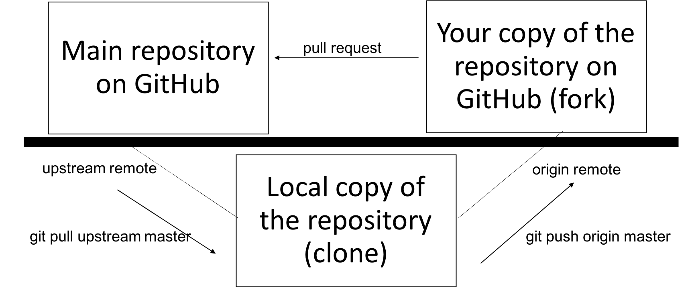
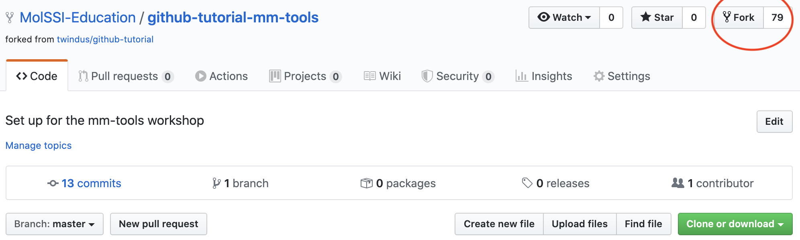
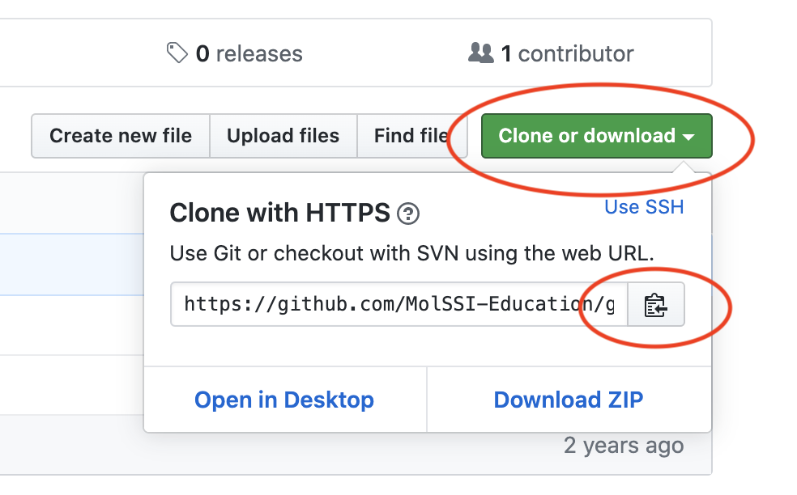
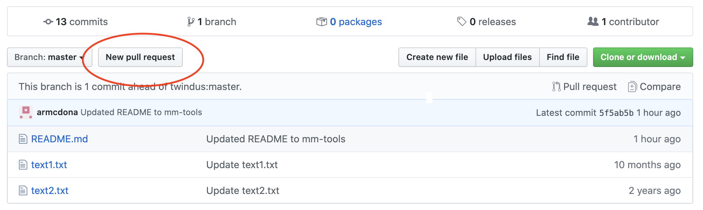
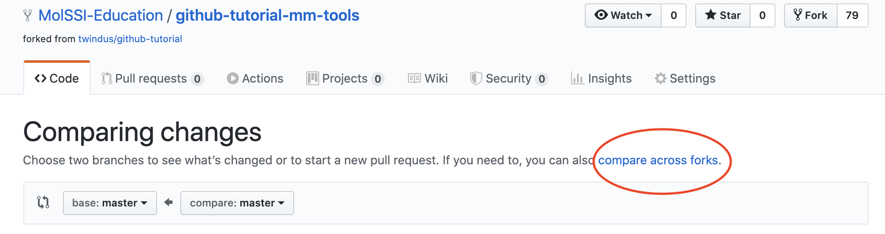
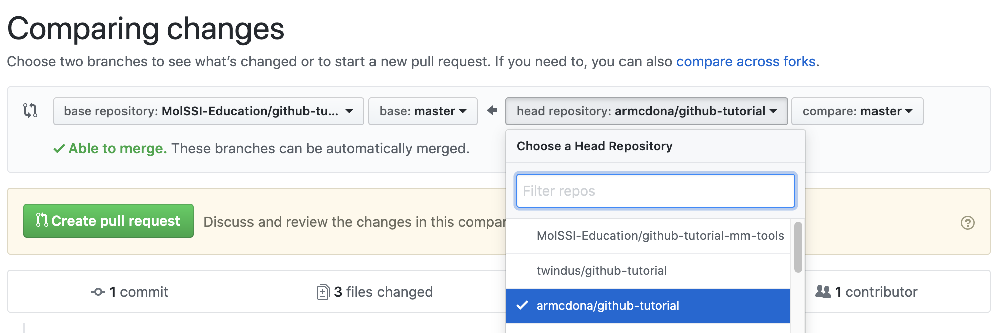
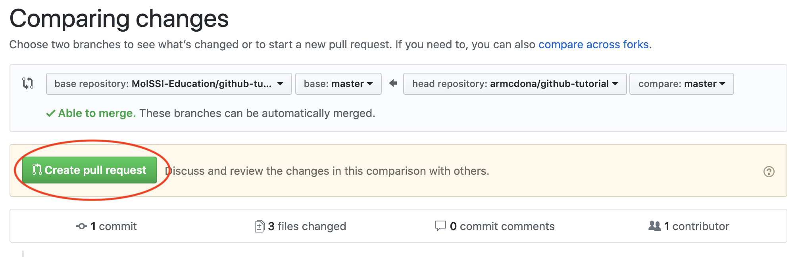
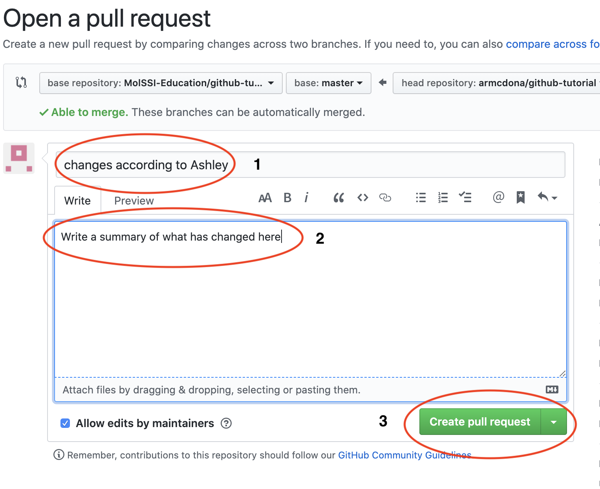

## Introduction
Have you ever been working on a project and wanted to go back to a previous version of the project?  Or perhaps you've worked on a group project where multiple people were making changes to files and you ended up with multiple versions of multiple files and it was very confusing?  Now imagine that you are working on a software project with 5, 10 or even 100 people.  Every person would need their own copies of all the code, but it would be very hard to keep up with the changes each person was making and merge them all together.  All of these issues can be handled by using *version control* on your project.  

Version control keeps a complete history of your work on a given project. It facilitates collaboration on projects where everyone can work freely on a part of the project without overriding others’ changes. You can move between past versions and rollback when needed. Also, you can review the history of your project through commit messages that describe changes on the source code and see what exactly has been modified in any given commit. You can see who made the changes and when it happened. This is greatly beneficial whether you are working independently or within a team.

In this activity, you will make a GitHub account, clone a working repository, and perform some basic tasks that are common in using GitHub and git as a community repository. Note that git and GitHub are extremely powerful and only a very small subset of the capabilities are shown in this exercise.

## git and GitHub
The software package `git` is one of the most popular software packages for version control.  [GitHub](https://github.com/) is an online hosting service which hosts the files of many software packages that use git so that these packages can be shared with other people.  Anyone can use git locally for version control without using GitHub.  To share your code on GitHub, you must create a GitHub account and profile.  
In this activity, you will make a GitHub account, clone a working repository, and perform some basic tasks that are common in using GitHub and git as a community repository. Note that git and GitHub are extremely powerful and only a very small subset of the capabilities are shown in this exercise.

## Make your own GitHub account
- In a browser go to ​https://github.com
- Fill in the blanks for Username, Email and Password (remember the password since you
will need it later).  
- Choose the “Unlimited public repositories for free” button and click “Continue”
- You can either fill in the survey and click “Continue” or click “Skip this step” (next to the “Continue” button at the bottom of the page)
- You will get an email to verify your email address. Click on the link in the email and log into your account.
- You now have a fully functioning account! (Although you can modify the behavior of
your repository using the “Settings” option, please don’t do that for this exercise.)

> ## Choosing your GitHub username
> It is now very common for employers or graduate advisors to review your GitHub as part of your application process.  Choose a GitHub username that is *recognizable* and *professional*.
{: .callout}

## Organization of GitHub
A collection of files for a certain project is called a *repository* on GitHub.  When you are collaborating with others on a project, there are at least three relevant copies of a repository:  the main repository on GitHub, your copy of the repository on GitHub, and the local copy of the repository on your computer.

## Make a fork of an existing GitHub repository to your GitHub account
- Go to [https://github.com/MolSSI-Education/github-tutorial-mm-tools](https://github.com/MolSSI-Education/github-tutorial-mm-tools).
- Click on the “Fork” button on the upper right corner of the screen:

- This will create a copy of the repository into ​your​ GitHub account and put your active browser page on ​your​ repository. This will allow you to make your own changes to the content of the repository.

## Set up a few things on your local git repository
So far, you have only interacted with GitHub. To most effectively make changes in a repository, it is most useful to have a copy (or clone) of the repository on your computer.

To do this, you will first need to open the Terminal window on your computer and set up your git repository.  There are several options depending on what operating system your computer is using.  If you already know how to open a Terminal window on your computer, use the method you already know.  
- If you installed anaconda and the jupyter notebook on your computer, you can use the Terminal from jupyter.  Launch jupyter notebook.  From the file navigator window that opens, click `New` in the upper right corner and choose `Terminal`.
- If you are on a Windows machine, go to the Start Menu and use the application “Git Bash”.
- If you are on a Mac, you can use the “Terminal” application (located in Applications/Utilities).

Any one of these will open a window where you can type in commands. For the rest of the exercise, we will call this window the “command window”.

Now we need to configure git so it knows a bit about you. The first command below is setting your email address and the second one sets your name. (This can be anything that you would like it to be, but most people use their real names so that others can tell who is working on a repository; remember what we said earlier about being professional!) These particular commands are setting options in a file names .gitconfig in your home directory and will be what is used for ALL of your git repositories. In the command window, type

~~~
$ git config --global user.name "<Firstname> <Lastname>"
$ git config --global user.email "<email address>"
~~~
{: .bash}

Make sure that you substitute in your actual e-mail for ​you@example.com​ and your real name for ​Your Name​. You will need the quotes around ​Your Name​.

## Make a clone on your own computer
A *clone* in GitHub is a copy of a GitHub repository on your own computer.  To clone the repository on your own computer, follow these steps.
- Go to the webpage for **your repository** on GitHub (not the main repository) and click on the green “Clone or download” button. Once the pop-up window opens, click on the clipboard icon to copy the URL into the clipboard (​make sure to grab the URL and not the ssh address​):

- Now, go to the command window. We will make a clone of the repository in GitHub to your local machine.  We will make a folder in your (Desktop) folder to make sure we know where it is. Type:

~~~
cd (Desktop)
mkdir molssi-mm-tools
cd molssi-mm-tools
git clone <url>
~~~
{: .bash}

where you should substitute the location of your Desktop folder for (Desktop). Also, <url>​ should be replaced with the url you copied above.  Make sure to use the url to **your repository** on GitHub.

- You should now have a copy of the repository on your computer. To get into the directory where the files are located, type:

~~~
cd github-tutorial
~~~
{: .bash}

Then type

~~~
ls
~~~
{: .bash}

so you can see a list of files in the directory.

## Making a change in a file
The next thing we will do is to make some changes in a couple of the files and commit them into the local git repository. Note that we can make as many changes to the files as we want without any fear of changing the repository until we use a “​git​” command. Even then, there are ways (that we won’t go into for this short tutorial) to recover from most commands. So, have no fear of trying things out! This is how you learn!

- Using a text editor (like Atom, TextWrangler or Notepad++), open up the file ​text1.txt​.
- Make any changes that you like - change words, delete sentences, add text, etc.
- Save and close the file.
- Open up the file ​text2.txt​ and again make any changes that you like, save and close the file.

At this point, you have only made changes to your local files, but not to the local git repository.  It can be hard to keep up with what you have changed and what you haven't.  In the command window, type:

~~~
git status
~~~
{: .bash}

This will show you what files in your directory have changed.  It will tell you that you have two files that have been modified, but you haven't actually added these changes to your local repository yet.  To add the files to your local repository, in the command window type

~~~
git add text1.txt text2.txt
git status
~~~
{: .bash}

The two files are now in a staging area and could be committed to the local repository. But before we do that, let’s add another file.

## Adding a new file

Let’s say that we decide we want to add another file that has some of our other favorite text in it to share with our fellow students. So, let’s make another file.
- Open your text editor (if it is not already open), and open a new file.
- Put in any text that you would like.
- Save the file as ​text3.txt​ and close it. (Make sure that the file that you created is in the directory with the other local files.)
- In the command window, type `git status​`.  You should now see that `text1` and `text2` are ready to commit (their writing should be in green), but that there is a new "untracked file".  An untracked file is one that you have not told git to keep up with.  

> ## Exercise
> Use appropriate git commands add this file to your local repository and check to make sure they are staged for a commit.
>
>> ## Answer
>> You need to add the files to your repository and then check the status.
>>
>> ~~~
>> git add
>> git status
>> ~~~
>> {: .bash}
>>
>{: .solution}
{: .challenge}

## Committing changes to the local repository
Now that we have all of the changes and additions that we want into the staging area, we are ready to put those changes into the repository.  This is called making a `commit`.  

~~~
git commit -m “some simple modifications and additions”
~~~
{: .bash}

The text in the quotes can be whatever message that you would like to give. The message should usually be more descriptive than this one is; the idea is to describe what the changes were. Now type `git status​` again in the command window.  You will now see that git says there is nothing to commit.  It will also say “Your branch is ahead of ‘origin/master’ by 1 commit.”  This is saying that you have made 1 commit to your local repository (a “branch” of your GitHub repository) that is not in your GitHub repository (‘origin/master’).

We could repeat making changes to our files and committing changes to our local repository until we have made all of the changes that we want. We can do as many `git commit​` commands as we need to get the files as we want them. Once this is done, we are ready to push our changes back up to the GitHub repository.

## Push our changes from our local git repository up to our GitHub account

Now we are ready to save the changes we have made on the *local* copy of the files (the files on your own computer) to the GitHub repository, where we might share them with others.  This is called making a `push` in git.  

~~~
git push origin master
~~~
{: .bash}

The `origin​` in that command means the place where the local repository was taken from, our GitHub account in this case, and ​master​ means the local branch that we want to push.  By default, your local git repository is called master.

You can check to see if your GitHub repository has been updated by going to the browser with your GitHub repository in it and refreshing the browser screen. You should see the message for the commit on ​text1.txt​ and ​text2.txt​, and you should also see the new file ​text3.txt​.

> ## What if my push doesn't work?
> Sometimes this command will hang (wait a minute or two though since sometimes other things on your computer can cause the hang). If so, type <ctrl-c> (hold the “ctrl” and “c” button at the same time) to cancel the current command. Then type:
>
> ~~~
> git config --global core.askpass "git-gui--askpass"
> git push origin master
> ~~~
> {: .bash}
>
> This may take a few minutes to run, but should pop up a window to ask you for your GitHub username and password. When it does this, fill these in and hit “Login”.
>
> If you still aren’t getting anything, type:
>
> ~~~
> GIT_CURL_VERBOSE=1 git push origin master
> ~~~
> {: .bash}
{: .callout}

## Requesting your changes be made to the upstream repository

Your changes are now in ​your​ GitHub repository.  However, you might want your changes to be incorporated into the main repository.  This is called the *upstream* repository.  The upstream repository is the repository where you originally made your fork, in this case the MolSSI education copy.  

To request that your changes be incorporated into the main repository, you will need to make a *pull request*. This is basically notifying the owner of the upstream repository that you would like some changes merged into the upstream repository. The originator can decide whether or not to include some or all of the changes into the upstream repository. To start the pull request follow these steps.
- Go back to the upstream repository by going to [https://github.com/MolSSI-Education/github-tutorial-mm-tools](https://github.com/MolSSI-Education/github-tutorial-mm-tools).  
- Click on the “New pull request” button:

- On the resulting page, click the “compare across forks” link:

- Next, you need to pick your fork to compare against. For base fork (on the left side) choose MolSSI-Education/github-tutorial-mm-tools.  For head fork (on the right) choose your fork from the dropdown menu.

- Next click on the green “Create pull request” button:

- On the resulting page, put in a title, some comment about what the pull request is in the comment box and click on the green “Create pull request” button.

- Now it will be up to the originator of the upstream repository to decide whether to merge your code into his/her repository.

## Conclusion

This is a very short exercise and doesn’t show all of the many features that are important when using repositories. In particular, it doesn’t show how to directly merge new changes from the upstream repository into your local repository on your computer. This is very important when working on collaborative projects where many people are contributing to the software on a regular basis. You will need to keep you working repository up to date with the upstream repository.  You can find additional MolSSI resources to learn more about git and GitHub [here](http://education.molssi.org/python_scripting_cms/09-version-control/index.html), [here](http://education.molssi.org/python-package-best-practices/02-git/index.html) and [here](http://education.molssi.org/python-package-best-practices/03-github/index.html).


